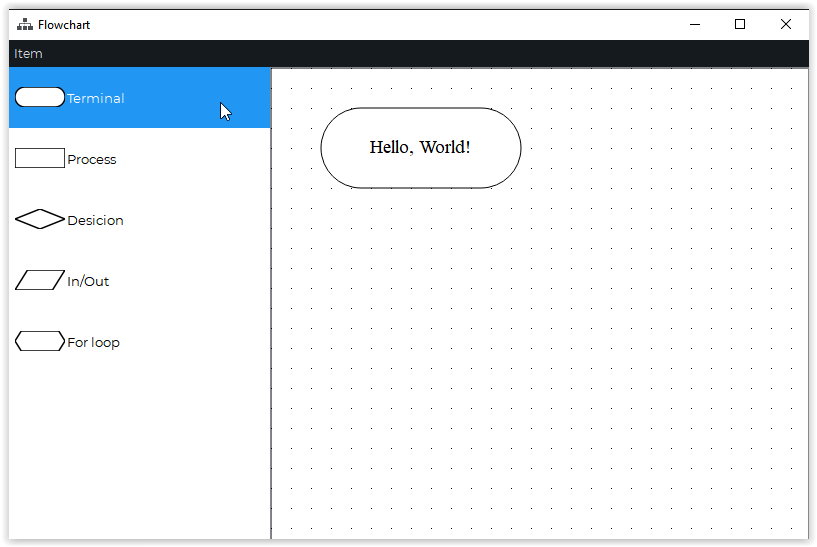
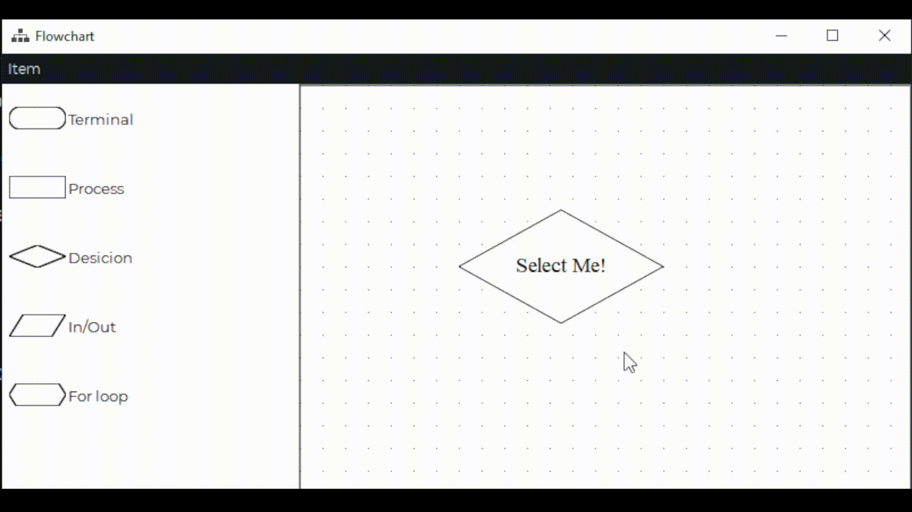
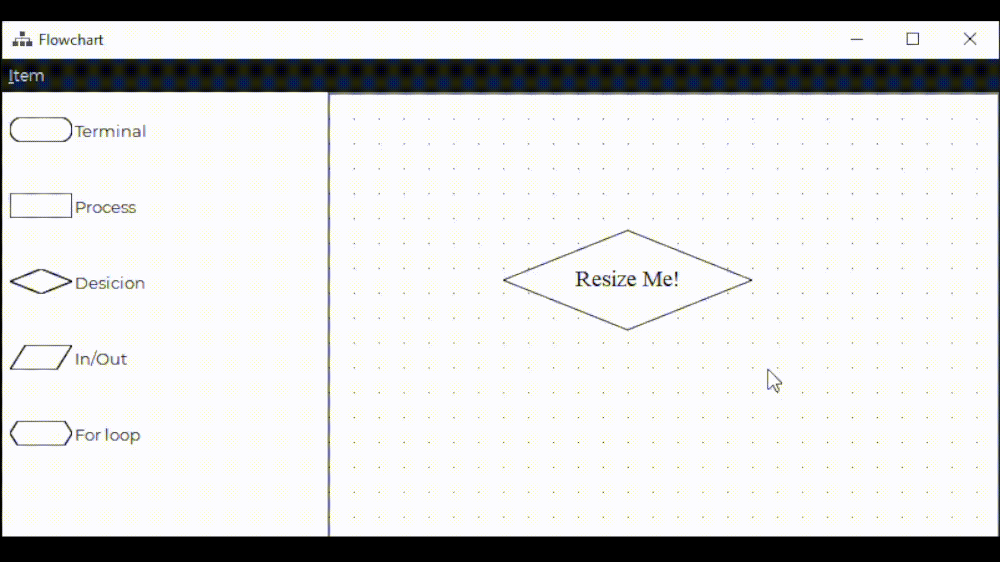
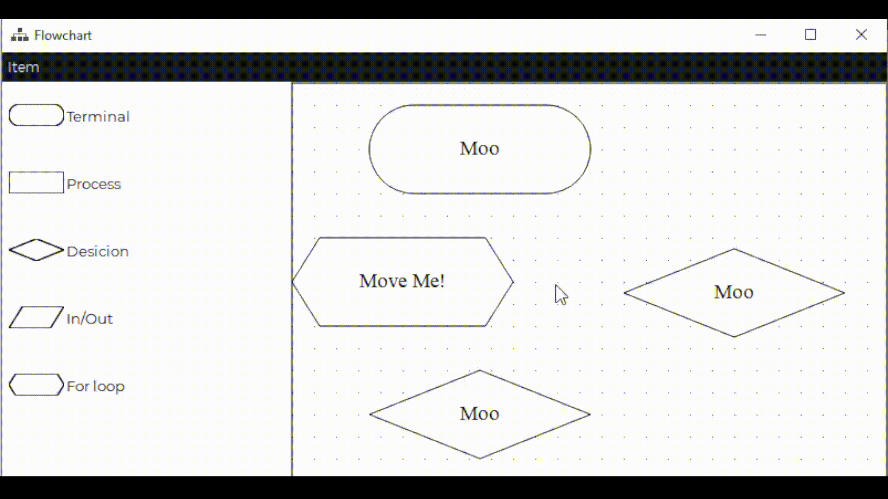
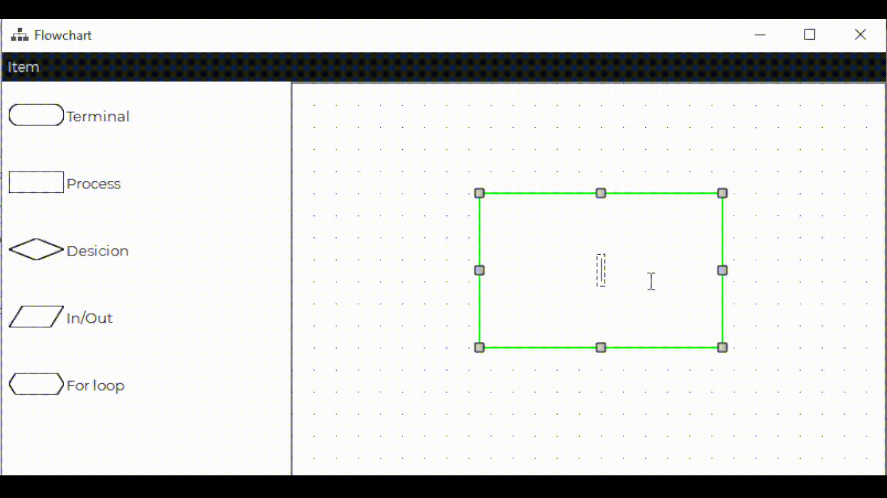

# Flowchart
Educational project. Developing for programming practice.
This project uses [Graphics View Framework](https://doc.qt.io/qt-5/graphicsview.html) and it similar to [Diagram Scene Example](https://doc.qt.io/qt-5/qtwidgets-graphicsview-diagramscene-example.html)

This project has some features:
- custom outline / stroke in selected state

- outside move preventing

- interactive resizing

- level-line (if item in same )

- text always centered

- setting text cursor mapped to text item

Soon will be add:
- copy / paste
- saving to and loading from JSON
- saving as .PNG
- scene switcher (multipage editing)
- path finding arrow-connectors
